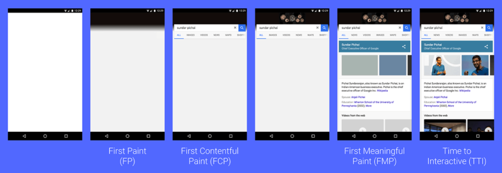
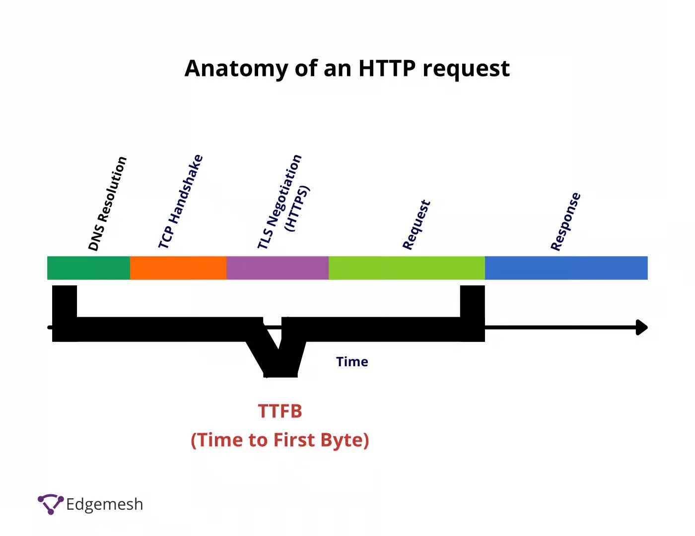
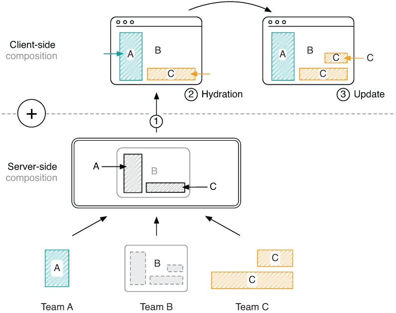

---
# try also 'default' to start simple
theme: seriph
# random image from a curated Unsplash collection by Anthony
# like them? see https://unsplash.com/collections/94734566/slidev
# background: https://source.unsplash.com/collection/94734566/1920x1080
background: 'src/images/initial.png'
# apply any windi css classes to the current slide
class: 'text-center'
# https://sli.dev/custom/highlighters.html
highlighter: shiki
# show line numbers in code blocks
lineNumbers: false
# some information about the slides, markdown enabled
info: |
  ## Slidev Starter Template
  what is SSR

# persist drawings in exports and build
drawings:
  persist: false

# page transition
transition: slide-up
# use UnoCSS
css: unocss
---

# Rendering on the web 

<!-- Presentation slides for developers -->

<div class="pt-12">
  <span @click="$slidev.nav.next" class="px-2 py-1 rounded cursor-pointer" hover="bg-white bg-opacity-10">
    What is SSR? <carbon:arrow-right class="inline"/>
  </span>
</div>

<div class="abs-tr m-6 flex gap-2">
  <a href="https://github.com/Paul-Isache" target="_blank" alt="GitHub"
    class="text-xl slidev-icon-btn opacity-50 !border-none !hover:text-white">
    <carbon-logo-github />
  </a>
</div>

---
transition: slide-up
---

# A few things about me

- developer for over a decade
- focused on JavaScript and cloud architecture
- working with NodeJS since version 0.14

-  <carbon-logo-twitter /> @paul_isache
-  <carbon-logo-github /> Paul-Isache

- slides link: https://github.com/Paul-Isache/presentations-slidev

<div class="abs-tr m-26 flex gap-2">
  
</div>

<div class="abs-br m-6 flex gap-2">
  <a href="https://twitter.com/paul_isache" target="_blank" alt="GitHub"
    class="text-xs slidev-icon-btn opacity-50 !border-none !hover:text-white">
     <carbon-logo-twitter /> @paul_isache
  </a>
</div>

---
transition: slide-up
---

# Rendering types

<div>
  <h3 v-click="1">CSR - client side rendering</h3>
  <p v-click="4">
    Client-side rendering (CSR) means rendering pages directly in the browser using JavaScript. All logic, data fetching, templating and routing are handled on the client rather than the server.
  </p>
</div>

<div>
  <h3 v-click="2">SSR - server side rendering</h3>
  <p v-click="5">
    Server rendering generates the full HTML for a page on the server in response to navigation. This avoids additional round-trips for data fetching and templating on the client, since it’s handled before the browser gets a response.
  </p>
</div>

<div>
  <h3 v-click="3">Static rendering</h3>
  <p v-click="6">
    Static rendering means producing a separate HTML file for each URL ahead of time.
  </p>
</div>

<div class="m-10"  v-click="7">
 <p class="emoji">🤔</p>
</div>

<div class="abs-br m-6 flex gap-2">
  <a href="https://twitter.com/paul_isache" target="_blank" alt="GitHub"
    class="text-xs slidev-icon-btn opacity-50 !border-none !hover:text-white">
     <carbon-logo-twitter /> @paul_isache
  </a>
</div>

<style>
  .emoji {
    font-size: 72px;
  }
</style>


---
transition: slide-up
---

# Terminology

- FP: first paint - is the time between navigation and when the browser first renders pixels to the screen, rendering anything that is visually different from the default background color of the body
- FCP: first contentful paint - measures the time from when the page starts loading to when any part of the page's content is rendered on the screen
- TTI: time to interactive - measures the time from when the page starts loading to when it's visually rendered, its initial scripts (if any) have loaded, and it's capable of reliably responding to user input quickly

<div>
 
</div>

<div class="abs-br m-6 flex gap-2">
  <a href="https://twitter.com/paul_isache" target="_blank" alt="GitHub"
    class="text-xs slidev-icon-btn opacity-50 !border-none !hover:text-white">
     <carbon-logo-twitter /> @paul_isache
  </a>
</div>


---
transition: slide-up
---

# Terminology

- TTFB: time to first byte - measures the time it takes for the network to respond to a user request with the first byte of a resource

<div>
  
</div>


<div class="abs-br m-6 flex gap-2">
  <a href="https://twitter.com/paul_isache" target="_blank" alt="GitHub"
    class="text-xs slidev-icon-btn opacity-50 !border-none !hover:text-white">
     <carbon-logo-twitter /> @paul_isache
  </a>
</div>

---
transition: slide-up
layout: 'cover'
background: 'src/images/confused.jpeg'
background-size: '100%'
# apply any windi css classes to the current slide
class: 'text-center'
---

# How does it really work 🤷🏻‍♂️

<div class="abs-bl m-6 flex gap-2">
  <a href="https://twitter.com/paul_isache" target="_blank" alt="GitHub"
    class="text-xs slidev-icon-btn opacity-50 !border-none !hover:text-white">
    Genereated using https://deepai.org/
  </a>
</div>

<div class="abs-br m-6 flex gap-2">
  <a href="https://twitter.com/paul_isache" target="_blank" alt="GitHub"
    class="text-xs slidev-icon-btn opacity-50 !border-none !hover:text-white">
     <carbon-logo-twitter /> @paul_isache
  </a>
</div>


---
transition: slide-up
---

# CSR web perfomance
<div flex flex-row h-full basis-full justify-center justify-between>
  <div >
    
    <a class="text-[8px] slidev-icon-btn opacity-50 !border-none !hover:text-white" href="https://dev.to/codewithtee/server-side-rendering-ssr-vs-client-side-rendering-csr-3m24">
      Image source
    </a>
    
  </div>

  <div w-100 v-click="1">
     
     <div>
      <ul>
       <li>slow TTI due to the load of JavaScript bundle</li>
      </ul>
     </div>
  </div>
</div>

<div class="abs-br m-6 flex gap-2">
  <a href="https://twitter.com/paul_isache" target="_blank" alt="GitHub"
    class="text-xs slidev-icon-btn opacity-50 !border-none !hover:text-white">
     <carbon-logo-twitter /> @paul_isache
  </a>
</div>

---
transition: slide-up
layout: two-cols
---

# CSR 

## Advantages
- Cheap and easy to host.  You can simply host your application on any CDN or static file host like Amazon S3 or Azure BlobStorage.

- Can more easily handle a high volume of simultaneous accesses as hosting on static file host.

- Caching is a technique where important, reusable scripts are stored in the client’s browser. 


::right::

#  &nbsp;
## Disadvantages

- Reduced compatiblity issues, as it does not extensively rely on the client-sid JavaScript libraries.

- Poor SEO (search engine optimization).

- Poor user experience on slower devices. Leaving rendering to the client-side can add seconds of load time on slower laptops and mobile devices.

- Slower load time as they need to make an additional round-trip to API. Code splitting and lazy load can reduce the TTI.


---
transition: slide-up
---

# SSR web performance
<div flex flex-row h-full basis-full justify-center justify-between>
  <div >
    
    <a class="text-[8px] slidev-icon-btn opacity-50 !border-none !hover:text-white" href="https://dev.to/codewithtee/server-side-rendering-ssr-vs-client-side-rendering-csr-3m24">
      Image source
    </a>
  </div>
  <div w-100 v-click="1">
     
     <div>
      <ul>
       <li>generaly reduced FP and FCP</li>
       <li>fast TTI as the JavaScript bundle should be lite</li>
      </ul>
     </div>
  </div>
</div>

<div class="abs-br m-6 flex gap-2">
  <a href="https://twitter.com/paul_isache" target="_blank" alt="GitHub"
    class="text-xs slidev-icon-btn opacity-50 !border-none !hover:text-white">
     <carbon-logo-twitter /> @paul_isache
  </a>
</div>

---
transition: slide-up
layout: two-cols
---

# SSR

## Advantages

- Server rendering generally produces a fast First Paint (FP) and First Contentful Paint (FCP). Running page logic and rendering on the server makes it possible to avoid sending lots of JavaScript to the client, which helps achieve a fast Time to Interactive (TTI).

- Good SEO 

- Reduced compatiblity issues, as it does not extensively rely on the client-side JavaScript libraries

- Improved data security. As within the API responses some informations are not rendered within the UI but they are sent as part of the response


::right::

#  &nbsp;

## Disadvantages

- Server-side rendering seems to be a simple concept; however, its complexity increases as the complexity of the application increases.

- As it requires servers access, the server should be able to handle high volume or autoscale


---
transition: slide-up
layout: 'cover'
background: 'src/images/gremlin.png'
background-size: '100%'
# apply any windi css classes to the current slide
class: 'text-center'
---

# Which one to pick
<div class="abs-tl m-6 flex gap-2">
  <a href="https://twitter.com/paul_isache" target="_blank" alt="GitHub"
    class="text-xs slidev-icon-btn opacity-50 !border-none !hover:text-white">
    Genereated using https://deepai.org/
  </a>
</div>

<div class="abs-bl m-6 flex gap-2">
  #cs-team #punIntended 
</div>

<div class="abs-br m-6 flex gap-2">
  <a href="https://twitter.com/paul_isache" target="_blank" alt="GitHub"
    class="text-xs slidev-icon-btn opacity-50 !border-none !hover:text-white">
     <carbon-logo-twitter /> @paul_isache
  </a>
</div>


---
transition: slide-up
background: 'src/images/deepthink.jpeg'
class: 'text-center'
layout: 'cover'
---

# CSR or SSR 🤔?

<div>
 <h3 v-click="1">Depends on use-case, timeline and buget 👩‍🔬👨‍🔬</h3>
 <h3 v-click="2">Best ideal case is a combination of both solutions (universal rendering), using rehydration 🤯</h3>
</div>


<div class="abs-br m-6 flex gap-2">
  <a href="https://twitter.com/paul_isache" target="_blank" alt="GitHub"
    class="text-xs slidev-icon-btn opacity-50 !border-none !hover:text-white">
     <carbon-logo-twitter /> @paul_isache
  </a>
</div>


---
transition: slide-up
layout: 'cover'
background: 'src/images/rehydration.jpg'
background-size: '100%'
class: 'text-center'
---

### univerasal rendering & rehydration 😱

<div class="abs-br m-6 flex gap-2">
  <a href="https://twitter.com/paul_isache" target="_blank" alt="GitHub"
    class="text-xs slidev-icon-btn opacity-50 !border-none !hover:text-white">
     <carbon-logo-twitter /> @paul_isache
  </a>
</div>


---
transition: slide-up
---

# What is re/hydration?

<div>
  <p>Rehydration is the attaching event handlers and data to the HTML generated by SSR on the client-side.</p>
  <p>Rehydration ensures that the HTML rendered on the client-side is interactive and behaves as expected. Without rehydration, the client-side JavaScript would have to re-fetch data and re-create event listeners, which would lead to slower page load times and a poor user experience.</p>
  <p>Rehydration is often used in conjunction with SSR frameworks such as Next.js, Remix, Gatsby, Angular Universal, Nuxt.js .... or VanillaJS 🍦</p>
</div >

<div class="abs-br m-6 flex gap-2">
  <a href="https://twitter.com/paul_isache" target="_blank" alt="GitHub"
    class="text-xs slidev-icon-btn opacity-50 !border-none !hover:text-white">
     <carbon-logo-twitter /> @paul_isache
  </a>
</div>

---
transition: slide-up
---

# What is universal rendering?

Universal rendering (composition), Isomorphic JavaScript, SSR essentially refer to the same concept: Having a single code-base that makes it possible to render and update markup on the server and in the browser.

<div class="flex gap-2">
  
</div>
<a class="text-[8px] slidev-icon-btn opacity-50 !border-none !hover:text-white" href="https://livebook.manning.com/book/micro-frontends-in-action/chapter-8">
  Image source: https://livebook.manning.com/book/micro-frontends-in-action
</a>

<div class="abs-br m-6 flex gap-2">
  <a href="https://twitter.com/paul_isache" target="_blank" alt="GitHub"
    class="text-xs slidev-icon-btn opacity-50 !border-none !hover:text-white">
     <carbon-logo-twitter /> @paul_isache
  </a>
</div>

---
transition: slide-up
layout: 'cover'
background: https://images.unsplash.com/photo-1543285198-3af15c4592ce?ixlib=rb-4.0.3&ixid=MnwxMjA3fDB8MHxwaG90by1wYWdlfHx8fGVufDB8fHx8&auto=format&fit=crop&w=2748&q=80
background-size: '100%'
class: 'text-center'
---

# So how does it work 

<div class="abs-br m-6 flex gap-2">
  <a href="https://twitter.com/paul_isache" target="_blank" alt="GitHub"
    class="text-xs slidev-icon-btn opacity-50 !border-none !hover:text-white">
     <carbon-logo-twitter /> @paul_isache
  </a>
</div>


---
layout: two-cols
transition: slide-up
---

# Data rehydration

```javascript {all|3-4|5|6-7|9|15|16|all} 
if (isClient && isFirstRender) {
  isFirstRender = false
  const element = document.getElementById('hydration')
  const data = element.dataset.fromserver
   if (!data) {
    fetch('/data').then(r => r.json())
      .then((json) => { window.todoList = json })
  } else {
    window.todoList = JSON.parse(data)
  }

  return
}

const appendedData = `data-fromServer='${JSON.stringify(todoList)}'`
let html = `<ul id="hydration" ${appendedData}>`

for (const item of todoList) {
  html += `<li>${item}</li>`
}

html += '</ul><input>'
html += '<button>Add</button>'
document.body.innerHTML = html
```

::right::

<div m-12>
  <ul>
    <li>check if the script is executed on the client</li>
    <li>parse response event</li>
    <li>append new item to list</li>
    <li>pass data as part of the data attribute, or as part of window object</li>
  </ul>
</div>


---
layout: two-cols
transition: slide-up
---

# Listening on event

```javascript {all|4-10|14|15|16|17-18|all} 
document.querySelector('button')
  .addEventListener('click', async () => {
    const item = document.querySelector('input').value
    const response = await fetch('/add', {
      method: 'POST',
      headers: {
        'Content-Type': 'application/json'
      },
      body: JSON.stringify({ item })
    })
    const status = await response.json()

    if (status) {
      window.todoList.push(item)
      const ul = document.getElementById('hydration')
      const li = document.createElement("li")
      li.appendChild(document.createTextNode(item))
      ul.appendChild(li)
      document.querySelector('input').value = ''
    }
  })
```

::right::

<div m-12>
  <ul>
    <li>attach event listener to button</li>
    <li>parse response event</li>
    <li>append new item to list</li>
  </ul>
</div>


---
transition: slide-up
layout: 'cover'
background: https://images.unsplash.com/photo-1543285198-3af15c4592ce?ixlib=rb-4.0.3&ixid=MnwxMjA3fDB8MHxwaG90by1wYWdlfHx8fGVufDB8fHx8&auto=format&fit=crop&w=2748&q=80
background-size: '100%'
class: 'text-center'
---

# demo 🧑🏻‍💻

<div class="abs-br m-6 flex gap-2">
  <a href="https://twitter.com/paul_isache" target="_blank" alt="GitHub"
    class="text-xs slidev-icon-btn opacity-50 !border-none !hover:text-white">
     <carbon-logo-twitter /> @paul_isache
  </a>
</div>

---
transition: slide-up
layout: 'cover'
background: 'src/images/rehydration.jpg'
background-size: '100%'
class: 'text-center'
---

<div>
  <a href="https://github.com/nearform/react-ssr-fastify-vite" target="_blank" alt="GitHub"
    class="text-xs slidev-icon-btn opacity-50 !border-none !hover:text-white">
     <carbon-logo-github /> GitHub example using React and fastify-vite
  </a> <br/>
  https://github.com/nearform/react-ssr-fastify-vite
</div>


---
transition: slide-up
---
# Wrap-up

- SSR is faster on the FP and FCP, but it adds some complexity

- you don't expose data which is not needed

- translations can be rendered on the server, so files are not on the client 

- it will take longer to setup and atchitect the components and layouts, for a similar setup

- leverage microfronteds to split code and setup different teams


---
transition: slide-up
layout: 'cover'
background: 'src/images/worth-it.jpeg'
background-size: '100%'
class: 'text-center'
---
# Is it worth it?

<div class="abs-br m-6 flex gap-2">
  <a href="https://twitter.com/paul_isache" target="_blank" alt="GitHub"
    class="text-xs slidev-icon-btn opacity-50 !border-none !hover:text-white">
     <carbon-logo-twitter /> @paul_isache
  </a>
</div>

---
transition: slide-up
background: 'src/images/q&a.jpeg'
layout: 'cover'
background-size: '100%'
class: 'text-center'
---
# Q&A
