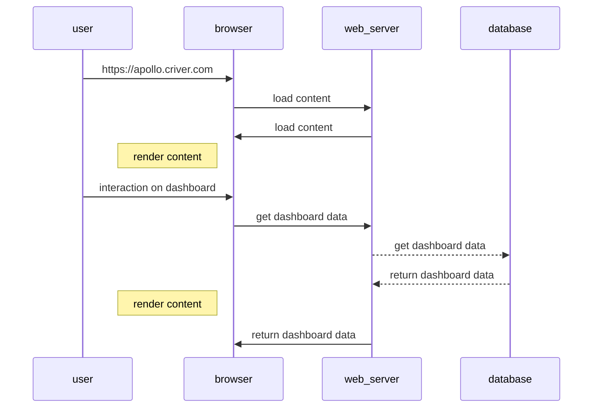
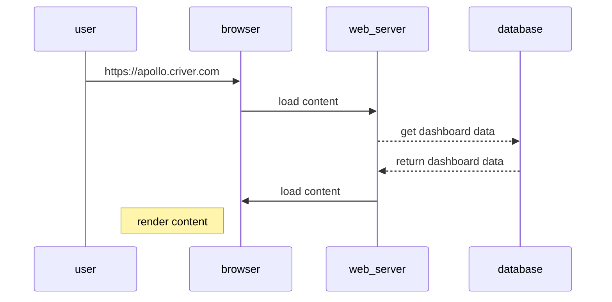

---
# try also 'default' to start simple
theme: seriph
# random image from a curated Unsplash collection by Anthony
# like them? see https://unsplash.com/collections/94734566/slidev
# background: https://source.unsplash.com/collection/94734566/1920x1080
background: 'src/images/initial.png'
# apply any windi css classes to the current slide
class: 'text-center'
# https://sli.dev/custom/highlighters.html
highlighter: shiki
# show line numbers in code blocks
lineNumbers: false
# some information about the slides, markdown enabled
info: |
  ## Slidev Starter Template
  what is SSR

# persist drawings in exports and build
drawings:
  persist: false

# page transition
transition: slide-left
# use UnoCSS
css: unocss
---

# Rendering on the web 

<!-- Presentation slides for developers -->

  
    <carbon:arrow-right class="inline"/>
  

  <a href="https://github.com/Paul-Isache" target="_blank" alt="GitHub"
    class="text-xl slidev-icon-btn opacity-50 !border-none !hover:text-white">
    <carbon-logo-github />
  </a>

---
transition: fade-out
---

# Rendering types

  <h3 v-click="1">CSR - server side rendering</h3>
  

    Client-side rendering (CSR) means rendering pages directly in the browser using JavaScript. All logic, data fetching, templating and routing are handled on the client rather than the server.
  

  <h3 v-click="2">SSR - server side rendering</h3>
  

    Server rendering generates the full HTML for a page on the server in response to navigation. This avoids additional round-trips for data fetching and templating on the client, since it’s handled before the browser gets a response.
  

 
🤔

  <a href="https://twitter.com/paul_isache" target="_blank" alt="GitHub"
    class="text-xs slidev-icon-btn opacity-50 !border-none !hover:text-white">
    <carbon-logo-twitter /> paul_isache
  </a>

---
transition: slide-up
---

# How client side rendering works

  <a href="https://twitter.com/paul_isache" target="_blank" alt="GitHub"
    class="text-xs slidev-icon-btn opacity-50 !border-none !hover:text-white">
    <carbon-logo-twitter /> paul_isache
  </a>

---
transition: slide-right
---

# How server side rendering works

  <a href="https://twitter.com/paul_isache" target="_blank" alt="GitHub"
    class="text-xs slidev-icon-btn opacity-50 !border-none !hover:text-white">
    <carbon-logo-twitter /> paul_isache
  </a>

---
transition: slide-right
layout: 'cover'
background: 'src/images/confused.jpeg'
background-size: '100%'
# apply any windi css classes to the current slide
class: 'text-center'
---

# How does it really work 🤷🏻‍♂️

  <a href="https://twitter.com/paul_isache" target="_blank" alt="GitHub"
    class="text-xs slidev-icon-btn opacity-50 !border-none !hover:text-white">
    Genereated using https://deepai.org/
  </a>

  <a href="https://twitter.com/paul_isache" target="_blank" alt="GitHub"
    class="text-xs slidev-icon-btn opacity-50 !border-none !hover:text-white">
    <carbon-logo-twitter /> paul_isache
  </a>

---
transition: slide-up
---

# Showcase

  

    
  

  

    
  

  <a href="https://twitter.com/paul_isache" target="_blank" alt="GitHub"
    class="text-xs slidev-icon-btn opacity-50 !border-none !hover:text-white">
    <carbon-logo-twitter /> paul_isache
  </a>

---
transition: slide-up
---

# Key factors

- TTFB: time to first byte 
- FP: first paint - CSR/SSR
- FCP: first contentful paint - CSR/SSR
- TTI: time to interactive - CSR/SSR

---
transition: slide-up
---

# Advantage disavantages

- Server-side rendering seems to be a simple concept; however, its complexity increases as the complexity of the application increases.
- Rendering a big application on the server-side can be very time consuming and it may increase the loading time due to it being a single bottleneck.

---
transition: slide-up
---

# Combining client and server side rendering

- Server-side rendering seems to be a simple concept; however, its complexity increases as the complexity of the application increases.
- Rendering a big application on the server-side can be very time consuming and it may increase the loading time due to it being a single bottleneck.

---
transition: slide-up
---

# rehydration pun

---
transition: slide-up
---

# what is rehydration and how it works

---
transition: slide-up
---

# best use scanerarios
when to
how to
frameworks

---
transition: slide-up
---
# QA

### Keyboard Shortcuts
|     |     |
| --- | --- |
| <kbd>right</kbd> / <kbd>space</kbd>| next animation or slide |
| <kbd>left</kbd>  / <kbd>shift</kbd><kbd>space</kbd> | previous animation or slide |
| <kbd>up</kbd> | previous slide |
| <kbd>down</kbd> | next slide |

<!-- https://sli.dev/guide/animations.html#click-animations -->

Here!

