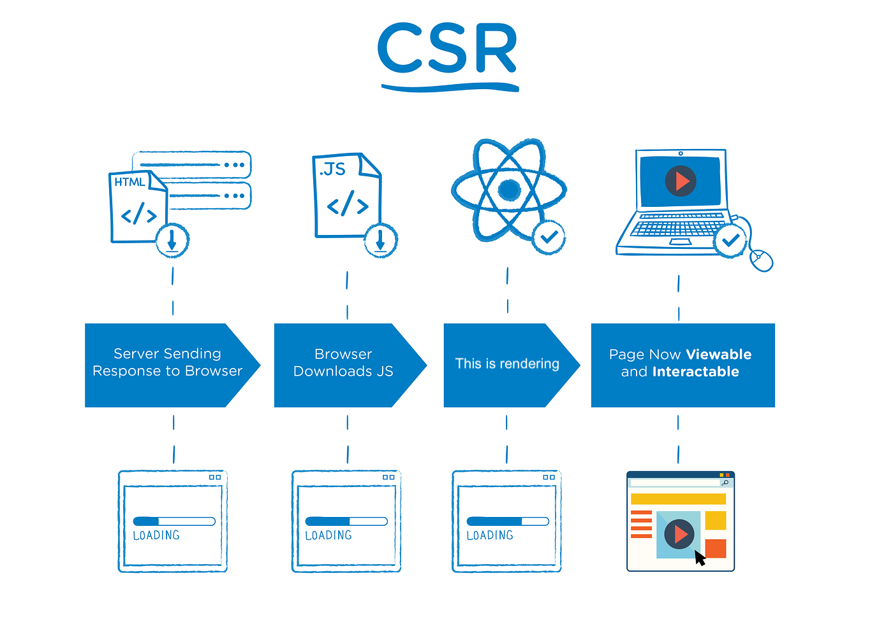
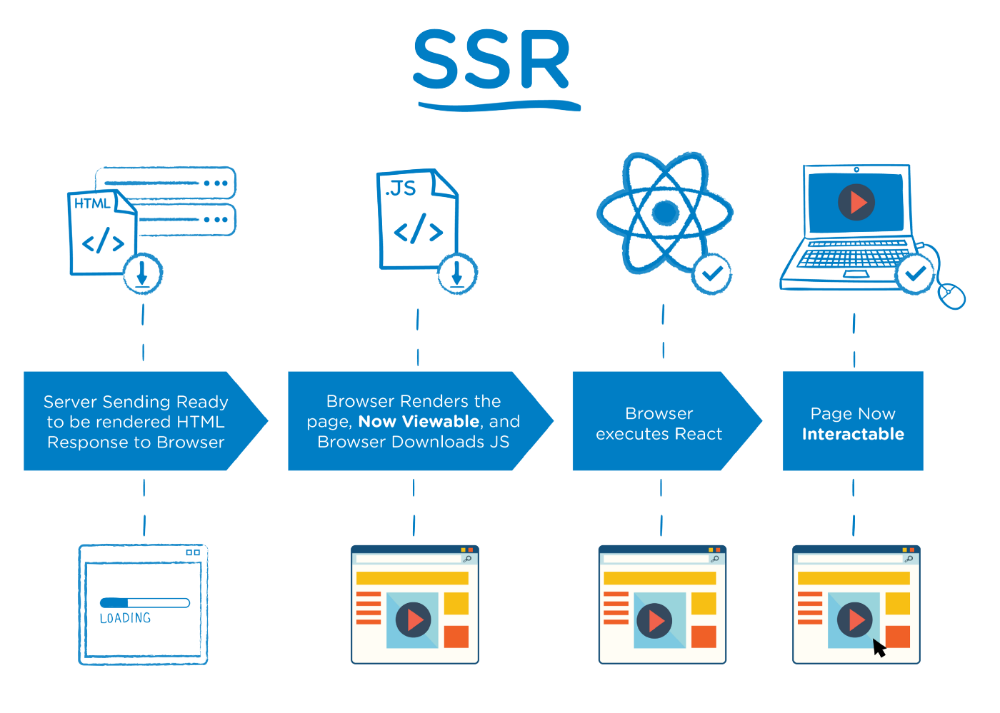

---
# try also 'default' to start simple
theme: seriph
# random image from a curated Unsplash collection by Anthony
# like them? see https://unsplash.com/collections/94734566/slidev
# background: https://source.unsplash.com/collection/94734566/1920x1080
background: 'src/images/initial.png'
# apply any windi css classes to the current slide
class: 'text-center'
# https://sli.dev/custom/highlighters.html
highlighter: shiki
# show line numbers in code blocks
lineNumbers: false
# some information about the slides, markdown enabled
info: |
  ## Slidev Starter Template
  what is SSR

# persist drawings in exports and build
drawings:
  persist: false

# page transition
transition: slide-up
# use UnoCSS
css: unocss
---

# Rendering on the web 

<!-- Presentation slides for developers -->

  
    What is SSR? <carbon:arrow-right class="inline"/>
  

  <a href="https://github.com/Paul-Isache" target="_blank" alt="GitHub"
    class="text-xl slidev-icon-btn opacity-50 !border-none !hover:text-white">
    <carbon-logo-github />
  </a>

---
transition: slide-up
---

# A few things about me

- developer for over a decade
- focused on JavaScript and cloud architecture
- working with NodeJS since version 0.14

-  <carbon-logo-twitter /> @paul_isache
-  <carbon-logo-github /> Paul-Isache

  

 

  <a href="https://twitter.com/paul_isache" target="_blank" alt="GitHub"
    class="text-xs slidev-icon-btn opacity-50 !border-none !hover:text-white">
     <carbon-logo-twitter /> @paul_isache
  </a>

---
transition: slide-up
---

# Rendering types

  <h3 v-click="1">CSR - server side rendering</h3>
  

    Client-side rendering (CSR) means rendering pages directly in the browser using JavaScript. All logic, data fetching, templating and routing are handled on the client rather than the server.
  

  <h3 v-click="2">SSR - server side rendering</h3>
  

    Server rendering generates the full HTML for a page on the server in response to navigation. This avoids additional round-trips for data fetching and templating on the client, since it’s handled before the browser gets a response.
  

 
🤔

  <a href="https://twitter.com/paul_isache" target="_blank" alt="GitHub"
    class="text-xs slidev-icon-btn opacity-50 !border-none !hover:text-white">
     <carbon-logo-twitter /> @paul_isache
  </a>

---
transition: slide-up
layout: 'cover'
background: 'src/images/confused.jpeg'
background-size: '100%'
# apply any windi css classes to the current slide
class: 'text-center'
---

# How does it really work 🤷🏻‍♂️

  <a href="https://twitter.com/paul_isache" target="_blank" alt="GitHub"
    class="text-xs slidev-icon-btn opacity-50 !border-none !hover:text-white">
    Genereated using https://deepai.org/
  </a>

  <a href="https://twitter.com/paul_isache" target="_blank" alt="GitHub"
    class="text-xs slidev-icon-btn opacity-50 !border-none !hover:text-white">
     <carbon-logo-twitter /> @paul_isache
  </a>

---
transition: slide-up
---

# Some useful acronyms

- TTFB: time to first byte - measures the time it takes for the network to respond to a user request with the first byte of a resource
- FP: first paint - is the time between navigation and when the browser first renders pixels to the screen, rendering anything that is visually different from the default background color of the body
- FCP: first contentful paint - measures the time from when the page starts loading to when any part of the page's content is rendered on the screen
- TTI: time to interactive - measures the time from when the page starts loading to when it's visually rendered, its initial scripts (if any) have loaded, and it's capable of reliably responding to user input quickly

  <a href="https://twitter.com/paul_isache" target="_blank" alt="GitHub"
    class="text-xs slidev-icon-btn opacity-50 !border-none !hover:text-white">
     <carbon-logo-twitter /> @paul_isache
  </a>

---
transition: slide-up
---

# CSR web perfomance

  

    
   
  

  

     
     

      <ul>
       <li>slow TTI due to the load of JavaScript bundle</li>
       <li>code splitting and lazy load can reduce the TTI</li>
      </ul>
     

  

  <a href="https://twitter.com/paul_isache" target="_blank" alt="GitHub"
    class="text-xs slidev-icon-btn opacity-50 !border-none !hover:text-white">
     <carbon-logo-twitter /> @paul_isache
  </a>

---
transition: slide-up
---

# SSR web performance

  

    
  

  

     
     

      <ul>
       <li>generaly reduced FP and FCP</li>
       <li>fast TTI as the JavaScript bundle should be lite</li>
      </ul>
     

  

  <a href="https://twitter.com/paul_isache" target="_blank" alt="GitHub"
    class="text-xs slidev-icon-btn opacity-50 !border-none !hover:text-white">
     <carbon-logo-twitter /> @paul_isache
  </a>

---
transition: slide-up
---

# SSR dis/advantage

- Server rendering generally produces a fast First Paint (FP) and First Contentful Paint (FCP). Running page logic and rendering on the server makes it possible to avoid sending lots of JavaScript to the client, which helps achieve a fast Time to Interactive (TTI). Good browser optimizations like streaming document parsing.

- Good for SEO 

- Reduced compatiblity issues, as it does not extensively rely on the client-sid JavaScript libraries

- Improved data security. As within the API responses some informations are not rendered within the UI but they are sent as part of the response

- Server-side rendering seems to be a simple concept; however, its complexity increases as the complexity of the application increases.

---
transition: slide-up
layout: 'cover'
background: 'src/images/gremlin.png'
background-size: '100%'
# apply any windi css classes to the current slide
class: 'text-center'
---

# Which one to pick

  <a href="https://twitter.com/paul_isache" target="_blank" alt="GitHub"
    class="text-xs slidev-icon-btn opacity-50 !border-none !hover:text-white">
    Genereated using https://deepai.org/
  </a>

  #cs-team #punIntended 

  <a href="https://twitter.com/paul_isache" target="_blank" alt="GitHub"
    class="text-xs slidev-icon-btn opacity-50 !border-none !hover:text-white">
     <carbon-logo-twitter /> @paul_isache
  </a>

---
transition: slide-up
background: 'src/images/deepthink.jpeg'
class: 'text-center'
layout: 'cover'
---

# CSR or SSR 🤔?

 <h2 v-click="1">Depends on use-case, do your research first 👩‍🔬👨‍🔬</h2>
 <h2 v-click="2">Best ideal case, a combination of both solutions, using rehydration 🤯</h2>

  <a href="https://twitter.com/paul_isache" target="_blank" alt="GitHub"
    class="text-xs slidev-icon-btn opacity-50 !border-none !hover:text-white">
     <carbon-logo-twitter /> @paul_isache
  </a>

---
transition: slide-up
layout: 'cover'
background: 'src/images/rehydration.jpg'
background-size: '100%'
class: 'text-center'
---

# rehydration 😱

  <a href="https://twitter.com/paul_isache" target="_blank" alt="GitHub"
    class="text-xs slidev-icon-btn opacity-50 !border-none !hover:text-white">
     <carbon-logo-twitter /> @paul_isache
  </a>

---
transition: slide-up
---

# What is rehydration?

  
Rehydration is the attaching event handlers and data to the HTML generated by SSR on the client-side.

  
Rehydration ensures that the HTML rendered on the client-side is interactive and behaves as expected. Without rehydration, the client-side JavaScript would have to re-fetch data and re-create event listeners, which would lead to slower page load times and a poor user experience.

  
Rehydration is often used in conjunction with SSR frameworks such as React, Next.js, Remix or Gatsby

---
transition: slide-up
layout: 'cover'
background: 'src/images/rehydration.jpg'
background-size: '100%'
class: 'text-center'
---

  <a href="https://github.com/nearform/the-fastify-ssr-workshop/tree/feat/walkthrought" target="_blank" alt="GitHub"
    class="text-xs slidev-icon-btn opacity-50 !border-none !hover:text-white">
     <carbon-logo-github /> GitHub example
  </a>  
  https://github.com/nearform/the-fastify-ssr-workshop/tree/feat/walkthrought

---
transition: slide-up
background: 'src/images/q&a.jpeg'
layout: 'cover'
background-size: '100%'
class: 'text-center'
---
# Q&A
